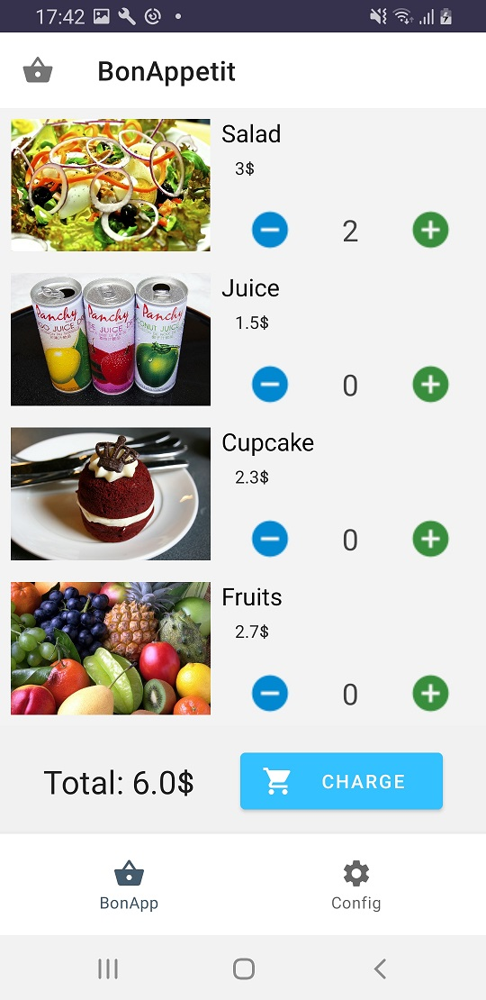
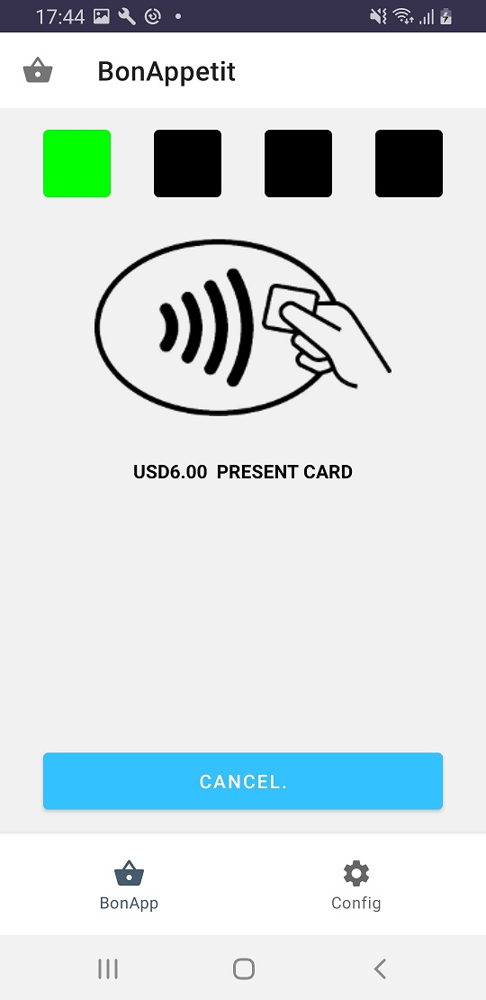
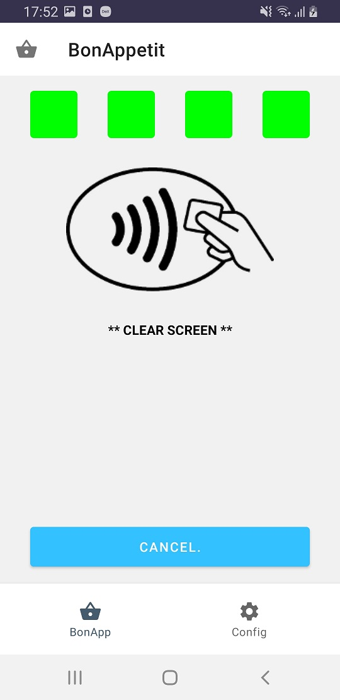
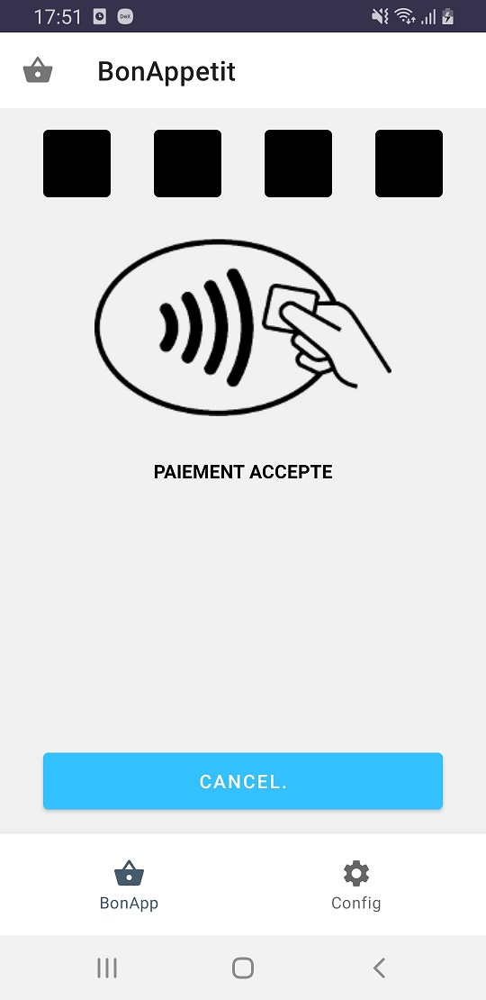

BonAppetit Demo User Guide
===========================

.. toctree::

Version History
---------------

+-----------+---------------+------------------------------+
| Version   | Date          | Revision Description         |
+-----------+---------------+------------------------------+
| 0.9.0     | April, 2020   | Release Version              |
+-----------+---------------+------------------------------+
| 0.9.1     | April, 2020   | Update Chapter 3.2 Content   |
+-----------+---------------+------------------------------+
| 1.0.0     | April, 2020   | First release in SDK         |
+-----------+---------------+------------------------------+
| 1.0.1     | Sept, 2022    | Ban old Android versions     |
+-----------+---------------+------------------------------+

Disclaimer
----------

National legislation and international treaties regarding copyright protect this material.  The name ALCINEO, its logo, software products, service names and their respective logos are registered trademark or service marks of ALCINEO, a private company registered under number 497 965 152 of Trade & Company Registry of Marseille, whose head offices are located at  ZI Athelia IV, 233 Avenue du Mistral, 13600 La Ciotat, France.

When they are not registered trademarks, the names of software products published by ALCINEO are protected by national and international trade name legislation and by national and international software legislation. The other cited brand names and registered trademarks are the property of their respective owners.

No part of this material may be reproduced, in any form or by any means, without prior written consent of ALCINEO, unless otherwise stated in a written agreement executed by ALCINEO. In no event, ALCINEO shall be liable for any typographical errors, screenshot errors or any consequences arising from incorrect use of this material.

This material is intended exclusively for information, educating and/or training purposes to its recipients. It can in no way be considered as any contract, agreement (including sui generis), or an advertising and/or promotional text.

This material may be stored in a digital format and therefore may be subject to alteration. ALCINEO shall not accept responsibility for any alteration or falsification of this material.

© |today| ALCINEO – All rights reserved.

.. raw:: latex

    \clearpage

Introduction
------------

Purpose
^^^^^^^

This document provides the information about the BonAppetit demonstration and sample project.

Scope
^^^^^

This document describes the content of the release as well as its
dependencies and the release history of the product.

Acronyms
--------

+-------+-------------------------------+
| APK   | Android Application Package   |
+-------+-------------------------------+
| ADB   | Android Debug Bridge          |
+-------+-------------------------------+

BonAppetit Demo Description
------------------------

Content
^^^^^^^

The Alcineo BonAppetit application is an Android software which allows to perform a transaction without using standard POS.
Alcinéo BonAppetit is a very simple example provided with source code to show how to develop easily a payment application based on our SoftPos SDK.

The BonAppetit Demo application supports VISA payWave and MasterCard MCL transactions.

If you want to support additional payment schemes, please contact the
sales department.

Device recommendation
^^^^^^^^^^^^^^^^^^^^^

For now, we have tested the current demonstration on the following
devices: Samsung S9, Samsung S10, Google Pixel 3XL, and on Android
version greater or equal to V9.0. For security reasons it is forbidden
to use mobiles with an older Android version.

How to install
--------------

Install SDK Platform Tools package
^^^^^^^^^^^^^^^^^^^^^^^^^^^^^^^^^^

There are several ways to install an application and one of them uses ADB which is included in the SDK Platform tools package.

SDK Platform Tools package is available for all three major operating systems including
Windows, Mac, and Linux.

Please go to the official website
(https://developer.android.com/studio/releases/platform-tools ) to
download the right SDK Platform Tools package version for your system.

Set Up the phone
^^^^^^^^^^^^^^^^

After installing and setting up SDK Platform Tools on your system you need also to
configure your Android device for ADB by enabling the option USB
debugging.

It depends on the version of Android but for the latest version it works like this

- Click Menu button to enter into App drawer.
- Go to "Settings".
- Scroll down to the bottom and tap "About phone" or "About tablet",
- Scroll down to the bottom of the "About phone" and locate the "Build Number" field.
- Tap the Build number field seven times to enable Developer Options. Tap a few times and you'll see a countdown that reads "You are now 3 steps away from being a developer."
- When you are done, you'll see the message "You are now a developer!".
- Tap the Back button and you'll see the Developer options menu under System on your Settings screen.

Install APK Using ADB
^^^^^^^^^^^^^^^^^^^^^

Plug in your Android device to your computer using a USB cable. If your
device prompts you to select a connection mode, choose data transfer.

Open a terminal.

-  For Windows, open the folder containing the ADB files, hold down the
   **Shift** key on your keyboard, right-click anywhere on your
   screen, and select **Open a command window here** or **"open PowerShell window here"**.

-  For Mac user, launch the **Terminal** app, type **cd**, press the
   **Spacebar**, drag and drop the ADB folder onto your Terminal window,
   and finally hit **Enter**. Your ADB folder should now be the current
   working directory in Terminal.

In the terminal window type:

.. code-block::

    ./adb devices

This command list all the ADB compatible
devices attached to your machine. You will find your Android device in
this list.

.. code-block::

   ./adb install <APK filename>

You need to confirm on your Android device the installation.

You can find more information about ADB on the official website:
https://developer.android.com/studio/command-line/adb.

Install APK without ADB
^^^^^^^^^^^^^^^^^^^^^^^

An alternative is to copy the apk file in the file system of the smartphone and launch it by clicking on it.
Please do not forget to uninstall first the previous version of the application.

How to use BonAppetit demonstration
--------------------------------

Test Cards
^^^^^^^^^^

In order to use the Alcineo BonAppetit Demo, you need VISA or MasterCard
payment test card.

For VISA we advise to use the card emulation application named "Visa
Mobile CDET". This application is available in Google Play Store
(https://play.google.com/store/apps/details?id=com.visa.app.cdet&hl=en
).

There is no such test tool for MasterCard. For this payment scheme you
need a real physical contactless test card. But note that your test card
may not be in line with the default settings already present with the
BonAppetit Demo.

BonAppetit User Manual
^^^^^^^^^^^^^^^^^^^^^^

The Bon Appetit Demo is a user friendly application. The screenshots below describe the main steps
to perform a contactless transaction.
The screen below displays some food items. Use button "+" to add an item in your cart or "-" button
to remove an item.

.. image:: BonAppetit_img1.jpg
   :width: 10.25800cm
   :height: 19.25800cm

In the screen below we have selected two items for an amount of $6.

Click on button <Charge> to start the transaction, the window below will be displayed:

After presenting the card on the back of your Android device, the window s below will be displayed:

You need to remove the card from the back of your Android device to complete the transaction.

In the demo the online server is simulated and the response sent by this fake server will be ‘APPROVED’
as shown below:

